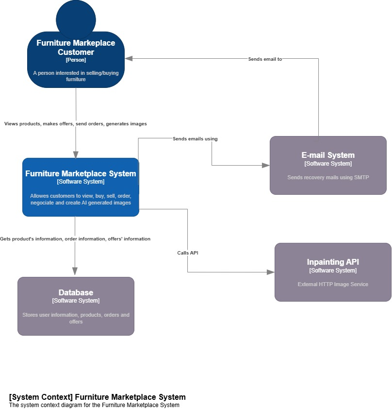

Furnish AI is a smart furniture marketplace that promotes sustainability through furniture resale. By using inpainting technology to visualize furniture in different environments, it enhances the buying and selling experience.

What It Does
Browse Furniture: Customers can explore a variety of furniture listings.
Make Offers: Buyers and sellers can negotiate prices through offers.
Place Orders: Users can place and track orders for the furniture they like.
Generate AI Images: Customers can generate AI-powered furniture visuals to help them imagine how items will look in different setups.
Email Support: The system sends recovery emails for password reset and account recovery.

System Architecture
You can see the high-level system architecture in the image below:

Demo:
https://www.youtube.com/watch?v=RBa7jOBJrzg&t=24s